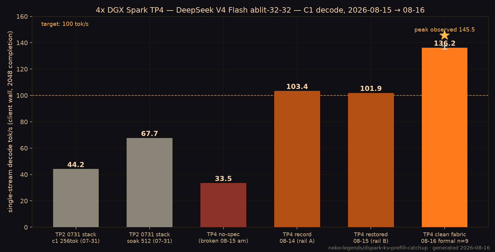
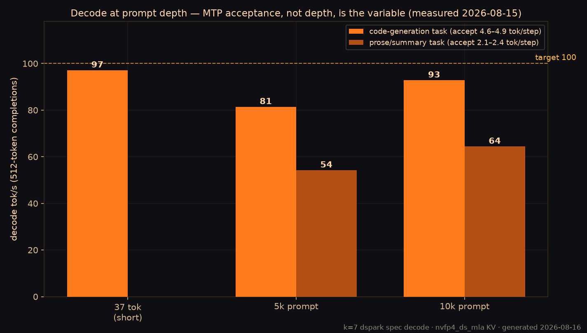
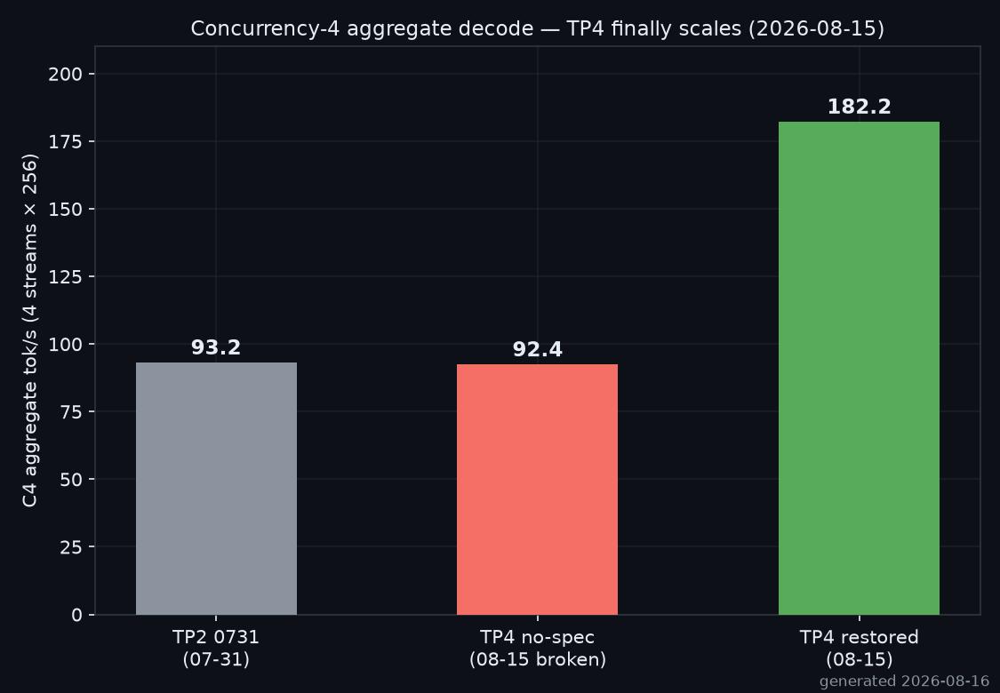

# dspark-kv-prefill-catchup

Two things in one repo:

1. **Stand up** DeepSeek V4 Flash (abliterated NVFP4) as one TP=4 vLLM world
   on four NVIDIA DGX Sparks.
2. **Keep an agent transcript warm** in that world's prefix cache so flipping
   to the local model is decode-only.

The serving recipe is why the sidecar is worth running. The sidecar is why a
day of chat on a fast hosted model can still land on Sparks without a
multi-minute prefill.

This is a **Neko Legends** project. The measured decode numbers are the
abliterated NVFP4 32-32 checkpoint, not stock official 0731.

---

## Catch-up in one page

You chat on grok / kimi / flash-fast all day. After every turn, and after
every compact, a tiny sidecar POSTs the **exact** OpenAI body the local
engine will see later, with `max_tokens=1`. vLLM prefix-caches it.

When you switch to `sparks/auto` (or any pin of that engine), the prompt is
already KV. TTFT is decode, not a 150k–330k prefill.

```text
you finish a turn on any model
        │
        ▼
 harness POST /v1/snapshot   ──►  sidecar  ──►  vLLM warmup (max_tokens=1)
        │
        ▼
 GET /v1/status  →  grey / orange / green / red
        │
        ▼
 switch to local model  →  same body  →  cache hit
```

### Status colors

| Color | State | Meaning |
|---|---|---|
| grey | `idle` | No snapshot yet, or sidecar off |
| orange | `warming` / `stale` | Warmup in flight, or transcript changed since last warm |
| green | `warm` | Last successful warmup hash equals the current snapshot |
| red | `error` | Last warmup failed (engine down, 400, too big) |

Green is **hash match after a finished warmup**, not “vLLM is idle.”
`cached_tokens` on the warmup call itself is often ~0 (that call *is* the
prefill). Do not wait for a high cache ratio on the first response.

### Rolling 1M

Reserve a window (default 1M tokens of a ~4.8M KV pool). Append-only growth
is a cheap delta. Sliding the window off the front is a **new** prefix —
the sidecar recomputes the kept tail in the background. Cut in big chunks
or compact. Do not drip-drop 1k tokens every turn past the cap.

### What the harness must get right

Warmup and the real turn must use the **same prompt builder** (same
messages, tools, chat-template kwargs). One extra clock line at the front
of the system prompt misses the whole cache.

Pi, Eva-core, Hermes, or anything else: implement the tiny bridge in
[`docs/BRIDGES.md`](docs/BRIDGES.md). Protocol:
[`docs/PROTOCOL.md`](docs/PROTOCOL.md).

```bash
python3 -m catchup --listen 127.0.0.1:18900 --vllm http://HEAD:18888/v1
```

---

## 4× DGX Spark serving recipe

Uncensored DeepSeek V4 Flash 0731 NVFP4, tensor-parallel across four NVIDIA
DGX Sparks (GB10) on a switched CX-7 RoCE fabric.

**Record single-stream decode: 145.5 tok/s** (observed peak, 2026-08-16).
Formal warmed C1 median: **136.25 tok/s** (n=9 clean, sd 1.3, 2026-08-16).



### Result

Abliterated NVFP4, thinking off, temperature 0, concurrency 1, 2048 completion
tokens, cluster idle. Server metric is
`Δ generation_tokens_total / Δ request_decode_time_seconds_sum`.
Client wall is `(completion_tokens − 1) / (t_last − t_first)` on streamed text.

| | tok/s |
|---| ---: |
| Observed peak (2026-08-16) | **145.5** |
| Formal C1 median (n=9 clean, 2026-08-16) | **136.25** |
| Formal C1 mean / sd | 136.6 / 1.27 |
| Formal C1 min / max | 135.1 / 139.3 |
| Previous record (2026-08-14, rail A, pre-cleanup) | 103.4 median, 113.8 engine window |
| Same cluster, no-spec (misconfigured boot) | 33.5 |

Clean trials only. Windows with a second in-flight request were dropped.

Live boot after this recipe (2026-08-16, clean fabric):

```text
GPU KV cache size: 5,600,636 tokens
Maximum concurrency for 1,048,576 tokens per request: ~5.3x
```

A short-prompt C1 number and a long-session agent number are different
measurements. Deep cached trunks decode slower. Publish both if you quote one.

Catch-up wants a **1M legal ceiling** so a reserved Eva window is not a 400.
Raising `max_model_len` to 1M does not grow KV GiB and does not raise C1.
It only makes a 1M snapshot legal. Prefill of a *cold* 1M is still minutes —
that is what catch-up exists to hide.

### Topology

Four GB10 nodes, one vLLM world, TP=4.

- Head serves the OpenAI-compatible API (`0.0.0.0:18888` here).
- Three workers are headless ranks.
- NCCL / Gloo / TP sockets stay on the CX-7 data NIC, never the tailnet.
- Management plane (SSH, dashboard) may use LAN or Tailscale.
- Fabric here: switched L2 RoCE, one 200G CX-7 port per node per rail
  (rail A `enp1s0f1np1` `192.168.2.0/24`, rail B `enP2p1s0f1np1`
  `192.168.10.0/24`, MTU 9000). Serving currently runs rail B, HCA
  `roceP2p1s0f1`. A MikroTik CRS812 aggregates the QSFP-DD links.
- **Exactly one IPv4 per fabric interface.** A second address (old mesh
  subnet, switch-management /24) on the NCCL iface both hangs bootstrap and
  quietly taxes per-step routing — removing the leftovers was worth ~30% C1
  (103.4 → 136.25 median on an otherwise identical config).
- The CX-7's second PCI function per port (`f0` / `np0`) is a **dark physical
  port** on this board, not a second lane-half: it has no carrier and nothing
  to give NCCL. `f1` alone is the full 200G port. The multi-HCA upgrade is
  dual-rail, not dual-function.

Set hostnames, IPs, and the model host path in `.env` (not committed).

### Serving shape

Image: `dspark-vllm-gx10:0.1.1-flashinfer-0.6.15` (Anemll 0.1.1 / vLLM 0.25.2).

```text
--tensor-parallel-size 4 --nnodes 4
--kv-cache-dtype nvfp4_ds_mla --block-size 256
--max-model-len 1048576         # reserved Eva window; KV pool GiB stays flat
--max-num-seqs 12
--max-num-batched-tokens 8264
--max-cudagraph-capture-size 96          # seqs × (k + 1)
--gpu-memory-utilization 0.85
--speculative-config k=7, draft_sample_method=probabilistic
--compilation-config {"cudagraph_mode":"FULL_DECODE_ONLY"}
--override-generation-config {"temperature":0.0}
--default-chat-template-kwargs {"thinking":false}
--moe-backend flashinfer_b12x
--enable-prefix-caching --async-scheduling --enable-chunked-prefill
```

`--ulimit nofile=1048576` on every rank. TP=4 opens enough NCCL sockets that
the image default of 1024 dies with `Too many open files`.

Launch from the head: worker ranks first, then the API rank.
See `scripts/start-dspark-tp4.sh`.

### Why these knobs

| knob | we run | why |
|---|---|---|
| `num_speculative_tokens` | 7 | This image’s kernels are shaped for dspark7. k=5 left ~18 tok/s on the table. |
| `draft_sample_method` | probabilistic | Matches the target distribution. Greedy collapses acceptance off temp 0. |
| `max_cudagraph_capture_size` | `seqs × (k+1)` = 96 | A copied `36` truncates to 32 and dumps larger batches into eager. |
| `max_num_batched_tokens` | 16384 | vLLM subtracts `(k−1)×seqs` from the prefill budget and warns below 8192. 32768 wedges the compile/autotune phase on all ranks (2026-08-15 incident) — grow this in stages, not jumps. |
| `gpu_memory_utilization` | 0.85 | 0.80 wastes ~7 GiB. 0.90 does not boot on this weight split. |
| `max_model_len` | 1048576 | Legal size for the reserved catch-up window. KV pool GiB is almost flat from 327k–1M. Does not raise C1 decode. |
| `cudagraph_mode` | FULL_DECODE_ONLY | One graph set. No measured cost. |
| GPU clock | `nvidia-smi -lgc 0,2200` on every node | Unlocked DVFS dips to ~1970 MHz under sustained prefill; the lock holds ~2171. Prefill 32k cold: ~2100 tok/s (was ~950 pre-cleanup; TP2's old baseline was 1576). Decode unchanged (not clock-bound). 2400 tested: same speed at +26% power. Persisted with `scripts/spark-gpu-clock-lock.service` (systemd, enabled on all four). |
| omitted `temperature` | forced 0.0 | `--generation-config vllm` otherwise defaults omitted temp to 1.0 and wrecks MTP accept. |
| thinking | off | On this checkpoint, thinking-on C1 was ~65 vs ~84–103 thinking-off. |

### Landmines

1. **One IPv4 on the NCCL NIC — enforced in netplan.** A leftover
   switch-management address as the primary IP makes NCCL advertise that
   address. Workers cannot reach it and hang at `ncclCommInitRank`. Stale
   point-to-point mesh files in `/etc/netplan` resurrect dead subnets on every
   reboot: delete or `.disabled` them, don't just `ip addr del`.
2. **Launches start disarmed.** `DSPARK_RESTART_POLICY=no`; the start script
   arms `unless-stopped` only after the API is up *and* spec-decode counters
   appear in `/metrics` (serving-shape gate). A config that cannot boot
   healthy must never wedge a node across reboots — and with `unless-stopped`
   from the start, it did (2026-08-15 incident).
3. **`ulimit -n` must be 1M inside the container.** `bash -lc` in the image
   drops nofile to 1024 unless you set it in compose *and* `ulimit` in the
   entrypoint.
4. **Do not `netplan apply` an old point-to-point mesh file** after moving to
   a switch. Persist the switched `/24` or the next reboot restores dead pair
   subnets.
5. **Quote decode with prompt length and warmup.** A 10 s engine average
   during a 400k prefill is not a decode record. Warm the graphs (several
   full-length generations) before publishing C1.
6. **Prefix cache is LRU.** Nightly / memory-world jobs with fat unique
   prompts can evict the reserved agent window. Cap those jobs. After a
   wave, POST the agent snapshot again (`reason=restore`).

Decode at depth and concurrency (measured 2026-08-15): MTP acceptance — not
prompt depth — is the variable. Code tasks hold 4.6–4.9 accepted tok/step at
5–10k (79–93 tok/s); repetitive prose drops to 2.1–2.4 (52–64 tok/s). C4
aggregate is 182 tok/s.




### Reproduce the C1 number

Cluster idle. No other clients. Thinking off. Temperature 0.

```bash
python3 scripts/bench-decode.py \
  --base-url http://HEAD:18888/v1 \
  --model deepseek-v4-flash-0731-ablit-32-32 \
  --max-tokens 2048 \
  --warmup 8 \
  --n 10
```

Report the Prometheus decode-only rate *and* the client stream wall rate.
Drop any trial where `request_success_total` increases by more than 1.

Raw trial lists: [`results/c1-decode-2026-08-14.json`](results/c1-decode-2026-08-14.json).

### What this is not

- Not official (non-abliterated) 0731 numbers.
- Not a 1M-prompt throughput claim. Nobody here has decoded *at* 1M.
- Not aggregate multi-stream throughput. C4/C12 is a different measurement.
- Not a license to ship prompts. Weights stay on the cluster.

---

## Layout

```text
.env.example                 fabric + serving + catch-up knobs
scripts/start-dspark-tp4.sh  worker-first launch
scripts/stop-dspark-tp4.sh
scripts/status-dspark-tp4.sh
scripts/bench-decode.py      C1 streaming + Prometheus decode rate
scripts/start-catchup.sh     sidecar
catchup/                     protocol + HTTP sidecar (stdlib only)
docs/PROTOCOL.md             harness-agnostic snapshot API
docs/BRIDGES.md              Pi / Eva-core / Hermes
results/                     measured artifacts
```

```bash
python3 -m unittest discover -s catchup -v
```
